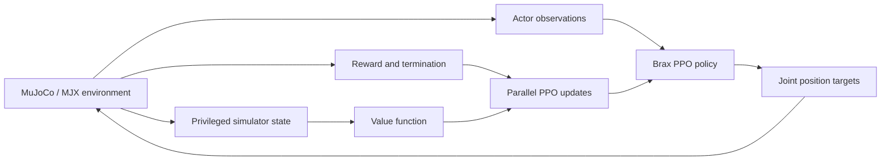

# Robot Learning Experiments

An independent reinforcement-learning study of humanoid locomotion and robotic
manipulation in MuJoCo Playground.

This repository presents two controlled studies built with MuJoCo/MJX, JAX, and Brax PPO:

- Unitree G1 locomotion baseline reproduction and disturbance evaluation
- Franka Panda manipulation reward curriculum and multi-seed evaluation

The emphasis is experimental discipline: reproduce a strong baseline, isolate one change at a time, measure behavior across seeds, document failure modes, and keep claims proportional to the evidence.

**Project status:** Complete. The repository preserves the verified results,
evaluation tools, selected rollouts, and lessons from the study.

## Start Here

- [Verified quantitative results](results/summary.md)
- [Project retrospective](docs/project-retrospective.md)
- [Resume, interview, and LinkedIn materials](docs/career-materials.md)
- [G1 baseline report](docs/experiments/g1-official-baseline.md)
- [Panda curriculum and evaluation audit](docs/experiments/panda-manipulation-curriculum.md)

## Results at a Glance

| Study | Training | Evaluation result |
|---|---:|---|
| Unitree G1 locomotion | 202,342,400 transitions | Reward improved from -5.801 to 15.578; peak 16.157 |
| G1 disturbance robustness | Existing baseline checkpoint | 5/5 seeds completed the 250-step push horizon; 0 early terminations |
| Panda staged manipulation curriculum | 1,638,400 final-stage transitions | 100% lift/hold; 96.7% target approach; 0% final target placement |

The G1 result reproduces the official `G1JoystickFlatTerrain` task. The Panda curriculum progressed from lifting to holding and transport. A v4 release reward produced transient near-target releases, but an evaluator audit found 0% final target placement.

## Behavior Progression

| Study | Improved rollout | Earlier diagnostic |
|---|---|---|
| Unitree G1 locomotion | [Official baseline walks beyond the camera frame](media/g1-official-baseline.mp4) | [Early policy falls forward immediately](media/g1-early-forward-fall.mp4) |
| Franka Panda manipulation | [Transport v3 grasps, lifts, holds, and moves the cube](media/panda-transport-v3.mp4) | [Initial policy drags the cube without lifting](media/panda-baseline-dragging.mp4) |

These videos illustrate behavioral progression; the quantified claims above come from instrumented evaluations, not selected rollouts. The Panda v3 clip remains the strongest saved successful manipulation rollout. A later v4 render showed the cube released near the floating target and then falling away, which triggered the metric audit and corrected the final-placement claim.

## Learning System



The G1 policy uses an asymmetric actor-critic design: the actor receives a 103-element deployable state vector, while the critic receives additional privileged simulation information during training.

## Key Engineering Work

- Reproduced the official G1 baseline from pinned MuJoCo Playground source.
- Built deterministic, per-step diagnostics for support geometry, torso orientation, velocity, contacts, action authority, and actuator force.
- Evaluated G1 robustness with randomized planar pushes across independent seeds.
- Designed reversible reward patches for Panda lifting, transport, and near-target release behavior.
- Built and audited an instrumented evaluator for lift, hold, target approach, gripper opening, transient release windows, and final target distance.
- Used TensorBoard, checkpoint manifests, headless EGL rendering, and bounded cloud runs with shutdown safeguards.

## What the Experiments Showed

- PPO optimizes expected return; it does not preserve or revert to one previously successful action sequence.
- Higher scalar reward did not consistently imply better balance or disturbance recovery.
- Poorly specified rewards produced recognizable shortcuts, including dragging and scooting.
- Behavior-level metrics, final-state checks, multi-seed evaluation, and rendered rollouts were more informative than reward curves alone.
- Visual validation exposed a misleading metric: an 85% transient near-target release window corresponded to 0% final target placement.
- Changing the actor observation size invalidated checkpoint normalization statistics and required training from scratch.
- Compilation time and cloud cost are part of the practical experiment budget.

## Repository Structure

```text
docs/experiments/    Experiment protocols, results, and limitations
results/             Concise, resume-safe metrics
scripts/diagnostics/ Per-step G1 and Panda evaluators
scripts/patches/     Reversible reward and recovery modifications
scripts/             Environment setup and smoke tests
media/               Selected before-and-after policy rollouts
```

## Reproducing the Environment

The setup script checks out the exact MuJoCo Playground commit used for the official baseline:

```bash
bash scripts/setup_mujoco_playground.sh
python scripts/smoke_test_mujoco_playground.py
```

Large checkpoints, raw run directories, credentials, and cloud-specific identifiers are intentionally excluded. The scripts assume Linux, Python 3.12, `uv`, and accelerator-compatible JAX for full training.

## Experiment Reports

- [G1 official baseline](docs/experiments/g1-official-baseline.md)
- [G1 push robustness](docs/experiments/g1-push-robustness.md)
- [Panda manipulation curriculum](docs/experiments/panda-manipulation-curriculum.md)
- [G1 observation augmentation attempt](docs/experiments/g1-observation-augmentation.md)
- [Verified results summary](results/summary.md)
- [Project retrospective](docs/project-retrospective.md)
- [Career materials](docs/career-materials.md)

## Limitations

The G1 push result applies only to the stated five-seed, 250-step protocol. It is not a universal stability guarantee.

The six-feature G1 observation experiment did not reach a valid training update before its compilation budget expired. It is documented as a bounded negative result, not as evidence that the proposed features help or hurt policy learning.

The Panda v4 target was sampled in free space without a support surface. Its original "stable placement" metric measured a transient open-gripper window near that target, not where the cube finished. Audited final placement was 0/60 episodes, so the earlier 85% label was withdrawn.

This project did not attempt sim-to-real transfer, hardware deployment, imitation
learning, or a new reinforcement-learning algorithm. Its contribution is a
carefully measured reproduction and reward-design study with documented positive
and negative results.

## Author

Noah Wilson  
Mechanical Engineering, University of Florida
